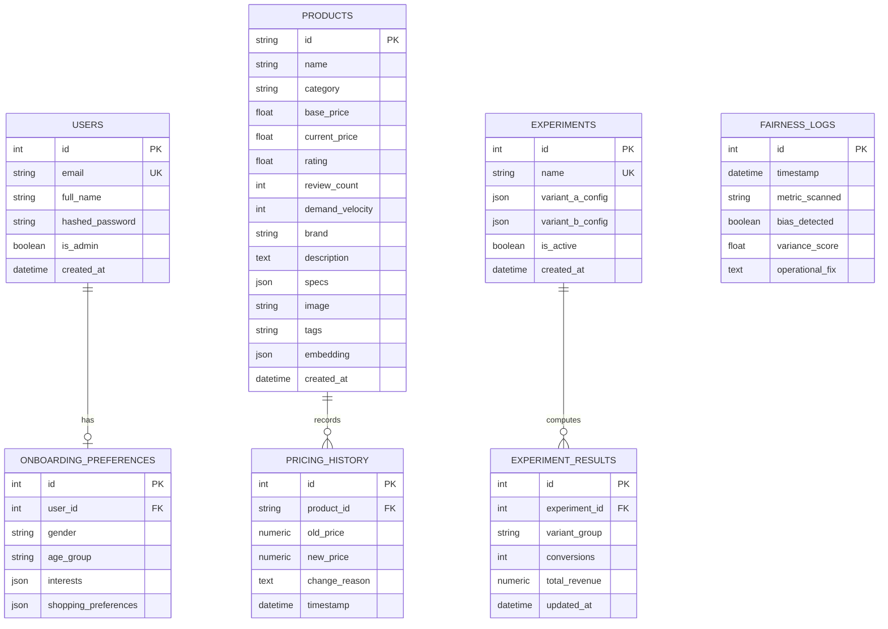

# StreamSync Production Architecture & Platform Guide

Welcome to the **StreamSync Platform Documentation**. This technical document outlines the design, schema spec, REST API index, and deployment procedures for StreamSync—a premium real-time e-commerce dynamic pricing and personalization platform.

---

## 1. System Architecture Topology

StreamSync features a modern, event-driven, non-blocking telemetry and dynamic repricing pipeline. All state transitions, catalog changes, and user interaction signals flow through an asynchronous processing queue to guarantee sub-millisecond API response latency.

### Flow Topology

```mermaid
graph TD
    %% Clients
    NextJS["Next.js 15 Storefront App Router<br>(Port 3000)"]
    ViteSPA["Vite SPA Admin Dashboard<br>(Port 3000)"]

    %% Gateway
    FastAPI["FastAPI Routing Gateway<br>(Port 8000)"]

    %% Queue / Cache
    RedisStream["Redis Streams & Cache<br>(stream:user_events & list:repricing_events)"]
    Postgres["PostgreSQL Database<br>(Port 5432)"]

    %% Background Workers
    PricingDaemon["Pricing Daemon Worker<br>(calculate_dynamic_sku_price)"]
    FairnessWorker["Compliance / Ethics Worker<br>(fairness_logs)"]

    %% Interactions
    NextJS -->|1. Async POST Event| FastAPI
    ViteSPA -->|Query Telemetry| FastAPI
    FastAPI -->|2. Non-blocking O(1) XADD| RedisStream
    RedisStream -->|3. Event Subscription| PricingDaemon
    PricingDaemon -->|4. Adjust SKU Price| Postgres
    PricingDaemon -->|5. Log Reprice Event| RedisStream
    PricingDaemon -->|6. Trigger Fairness Audit| FairnessWorker
    FairnessWorker -->|7. Record Fairness Metrics| Postgres
    FastAPI <-->|Fetch Live Cache| RedisStream
    FastAPI <-->|Transaction Log| Postgres
```

### Key Processing Stages

1. **Non-Blocking Telemetry Ingestion (`POST /api/v1/events`)**
   When a user views a product, interacts with the storefront, or checks out, Next.js fires a non-blocking `POST` event tracking request to the FastAPI gateway. FastAPI immediately drops this payload into a Redis Stream (`stream:user_events`) using an $O(1)$ `XADD` operation, returning `202 Accepted` to the client in under 5ms.
2. **Asynchronous Daemon Repricing**
   The `pricing_daemon_worker` runs a persistent background consumer group subscribing to the Redis Stream. When events arrive, it calculates dynamic SKU pricing based on consumer demand velocity patterns, inventory levels, and competitor inputs.
3. **Shock Absorption & Guardrails Clamping**
   The pricing algorithm enforces mathematical shock-absorption boundaries, clamping dynamic multipliers strictly between **70%** (floor) and **150%** (ceiling) of the base product price. The output prices are written back transactionally to PostgreSQL and recorded in Redis.
4. **Fairness Audit Log Processing**
   Following a repricing cycle, the compliance/ethics engine (`fairness_worker`) conducts automated fairness verification, flagging outlier metrics or disparate impact ratios to the `fairness_logs` table.

---

## 2. Database Entity Relationship Spec

The database is built on PostgreSQL 15, managed using SQLAlchemy ORM configurations. 

### Entity Relationship Diagram



### Schema Attributes & Constraints

*   **`users`**: Manages client profiles, administrative roles, and authentication hashes.
*   **`onboarding_preferences`**: Stores age, gender interest matrices, and category affinity tags captured during multi-step onboarding.
*   **`products`**: Central catalog index, containing HSL color coordinates, high-resolution media references, demand velocity indicators, and `384-dimensional` vector representations for similarity query rankings.
*   **`pricing_history`**: Holds audit-ready transaction records detailing pricing updates and narrative descriptions explaining why a price adjustment was triggered.
*   **`fairness_logs`**: Tracks compliance logs indicating statistical variance and potential bias issues.
*   **`experiments`**: Manages operational configurations for active A/B experiments.
*   **`experiment_results`**: Automatically records conversions, click rates, and variant group earnings.

---

## 3. API Operations Index

### Telemetry & Events Ingestion
*   **`POST /api/v1/events`**
    *   *Description*: Logs non-blocking user interactions (e.g. view, cart addition, checkout) to Redis Streams.
    *   *Payload*:
        ```json
        {
          "user_id": "usr_7832",
          "session_id": "sess_99341",
          "event_type": "view",
          "sku": "prod-shoes-99"
        }
        ```
    *   *Response Code*: `202 Accepted`

### Recommendations
*   **`GET /api/v1/recommendations/personalized`**
    *   *Description*: Evaluates session history and onboarding profile attributes to deliver vector-similarity personalizations or fallback trending products.
    *   *Query Parameters*: `session_id`, `user_id`
    *   *Response*:
        ```json
        {
          "recommender": "vector_similarity",
          "products": [
            {
              "id": "prod-shoes-99",
              "name": "Zenith Velocity Runners",
              "category": "Footwear",
              "current_price": 84.50
            }
          ]
        }
        ```

### System Analytics & Monitoring
*   **`GET /api/v1/analytics/overview`**
    *   *Description*: Serves dashboard overview counts and system health trends for dynamic telemetry feeds.
    *   *Response*:
        ```json
        {
          "p99Latency": 138.4,
          "activeSkus": "10.4M",
          "repricingRate": "42,100/s",
          "activeSessions": 18450,
          "cacheHitRate": 99.2,
          "streamLag": "12ms",
          "current_tick": {
            "time": "10:32:00",
            "variableFactor": 1.15,
            "velocity": 180
          }
        }
        ```

### Onboarding & Profile Registry
*   **`POST /api/v1/users/onboarding`**
    *   *Description*: Submits and records multi-step preference matrix configurations to PostgreSQL.
    *   *Payload*:
        ```json
        {
          "user_id": 14,
          "age_group": "26-35",
          "gender": "Female",
          "interests": ["Electronics", "Fitness"],
          "shopping_preferences": {
            "ecoFriendly": true,
            "dealPriority": false
          }
        }
        ```

### Experiments Telemetry
*   **`POST /api/v1/experiments/track`**
    *   *Description*: Records experiment metrics (conversions and transaction earnings) for B/A testing evaluation.

---

## 4. Deployment & Quick-Start Guide

StreamSync is containerized to deploy the entire production stack onto a single node in seconds.

### Quick Start with Docker Compose

1.  **Clone the workspace and verify structure:**
    Ensure you are in the directory containing `docker-compose.yml`.

2.  **Spin up the entire application stack:**
    ```bash
    docker-compose up --build -d
    ```
    This single command builds and starts the following services:
    *   `streamsync_postgres`: PostgreSQL 15 database listening on `5432` with pre-defined database volume mount options.
    *   `streamsync_redis`: Redis 7 server with Append Only File (AOF) persistence enabled, listening on `6379`.
    *   `streamsync_backend`: FastAPI app server operating on `http://localhost:8000`.
    *   `streamsync_pricing_worker`: Python worker handling stream calculations and DB logging.
    *   `streamsync_frontend`: Next.js 15 production server listening on `http://localhost:3000`.

3.  **Perform Deployment Verification:**
    Validate health metrics endpoints by testing the backend's root endpoint:
    ```bash
    curl http://localhost:8000/
    ```
    Expected JSON response:
    ```json
    {"status": "ok", "message": "StreamSync Backend is alive!"}
    ```

4.  **Tear down deployment:**
    To stop all services and preserve data volumes:
    ```bash
    docker-compose down
    ```
